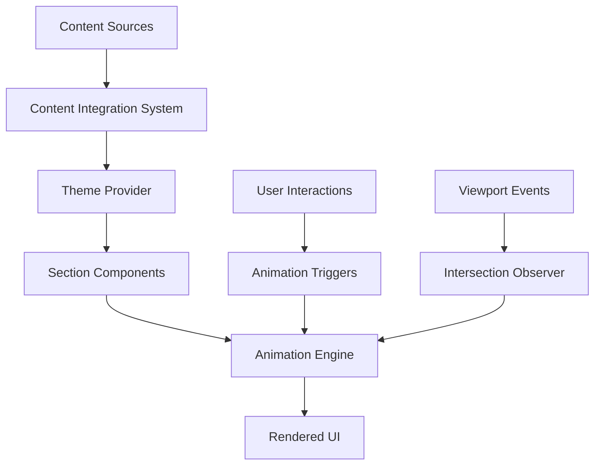

# Design Document: Website Redesign Implementation

## Overview

This design document outlines the technical architecture and implementation approach for the comprehensive website redesign of Media Mantra Global. The redesign focuses on visual consistency, interactive elements, content updates, and performance optimization while maintaining the existing Next.js architecture.

The implementation will enhance the current component-based architecture with new interactive elements including animated metrics, revolving globe, improved video handling, and a comprehensive color theming system. The design leverages existing technologies (Next.js 16, React 19, Framer Motion, GSAP, Tailwind CSS) while introducing new components for enhanced user experience.

## Architecture

### System Architecture

The website follows a modern Next.js App Router architecture with the following key layers:

```
┌─────────────────────────────────────────┐
│           Presentation Layer            │
│  (React Components + Tailwind CSS)     │
├─────────────────────────────────────────┤
│           Animation Layer               │
│    (Framer Motion + GSAP + CSS)        │
├─────────────────────────────────────────┤
│           Content Layer                 │
│      (Static Data + CMS Integration)    │
├─────────────────────────────────────────┤
│           Routing Layer                 │
│         (Next.js App Router)           │
├─────────────────────────────────────────┤
│           Infrastructure Layer          │
│    (Next.js Runtime + Deployment)      │
└─────────────────────────────────────────┘
```

### Component Architecture

The redesign extends the existing component structure with new specialized components:

```
src/components/
├── theme/
│   ├── color-theme-provider.tsx      # New: Color theme management
│   └── section-theme-wrapper.tsx     # New: Section-level theming
├── animations/
│   ├── animated-metrics.tsx          # New: Animated number counters
│   ├── revolving-globe.tsx           # New: Interactive globe component
│   └── viewport-trigger.tsx          # New: Animation trigger utility
├── video/
│   ├── optimized-video-player.tsx    # Enhanced: Improved video handling
│   └── video-quality-manager.tsx     # New: Quality optimization
├── content/
│   ├── content-integration-system.tsx # New: Dynamic content management
│   └── responsive-content.tsx        # New: Device-aware content
└── career/
    ├── career-portal.tsx             # New: Career page with dropdowns
    └── job-listing-accordion.tsx     # New: Expandable job listings
```

### Data Flow Architecture



## Components and Interfaces

### Color Theme System

The Color Theme System manages consistent visual theming across all sections:

```typescript
interface ColorThemeConfig {
  background: 'white' | 'graphite' | 'cream';
  headlineColor: 'blue' | 'white' | 'gold';
  textColor: 'graphite' | 'cream' | 'light';
  accentColor?: 'gold' | 'blue';
}

interface SectionTheme {
  sectionId: string;
  theme: ColorThemeConfig;
  customStyles?: Record<string, string>;
}

class ColorThemeSystem {
  applyTheme(sectionId: string, theme: ColorThemeConfig): void;
  getThemeClasses(theme: ColorThemeConfig): string[];
  validateThemeConsistency(): boolean;
}
```

### Animation Engine

The Animation Engine coordinates all animated elements with performance optimization:

```typescript
interface AnimationConfig {
  type: 'counter' | 'globe' | 'fade' | 'slide';
  duration: number;
  easing: string;
  trigger: 'viewport' | 'load' | 'interaction';
  delay?: number;
}

interface MetricsAnimation extends AnimationConfig {
  startValue: number;
  endValue: number;
  format: 'number' | 'percentage' | 'currency';
  suffix?: string;
}

class AnimationEngine {
  registerAnimation(id: string, config: AnimationConfig): void;
  triggerAnimation(id: string): Promise<void>;
  pauseAllAnimations(): void;
  resumeAnimations(): void;
}
```

### Globe Component

The revolving globe component provides smooth 3D-like rotation:

```typescript
interface GlobeConfig {
  rotationSpeed: number; // degrees per second
  pauseOnHover: boolean;
  responsive: boolean;
  quality: 'low' | 'medium' | 'high';
}

interface GlobeComponent {
  startRotation(): void;
  stopRotation(): void;
  setSpeed(speed: number): void;
  handleResize(): void;
}
```

### Video Quality Manager

Enhanced video handling with quality optimization:

```typescript
interface VideoConfig {
  src: string;
  quality: 'auto' | 'high' | 'medium' | 'low';
  muted: boolean;
  autoplay: boolean;
  loop: boolean;
  preload: 'auto' | 'metadata' | 'none';
}

interface VideoQualityManager {
  optimizeForConnection(): VideoConfig;
  handleQualityChange(quality: string): void;
  preloadOptimization(): void;
  getOptimalBitrate(): number;
}
```

### Content Integration System

Dynamic content management for seamless updates:

```typescript
interface ContentSource {
  type: 'document' | 'api' | 'static';
  source: string;
  format: 'markdown' | 'json' | 'html';
}

interface ContentSection {
  sectionId: string;
  content: ContentSource;
  fallback?: string;
  cache?: boolean;
}

class ContentIntegrationSystem {
  loadContent(section: ContentSection): Promise<string>;
  updateContent(sectionId: string, content: string): void;
  validateContent(content: string): boolean;
  cacheContent(sectionId: string, content: string): void;
}
```

### Career Portal

Interactive career page with expandable job listings:

```typescript
interface JobListing {
  id: string;
  title: string;
  department: string;
  location: string;
  type: 'full-time' | 'part-time' | 'contract';
  description: string;
  requirements: string[];
  benefits: string[];
}

interface CareerPortalConfig {
  groupBy: 'department' | 'location' | 'type';
  expandable: boolean;
  searchable: boolean;
  filterOptions: string[];
}

class CareerPortal {
  loadJobListings(): Promise<JobListing[]>;
  filterJobs(criteria: Record<string, string>): JobListing[];
  expandJob(jobId: string): void;
  collapseJob(jobId: string): void;
}
```

## Data Models

### Theme Configuration Model

```typescript
interface ThemeConfiguration {
  sections: {
    [sectionId: string]: {
      background: 'white' | 'graphite' | 'cream';
      headline: 'blue' | 'white' | 'gold';
      text: 'graphite' | 'cream' | 'light';
      borders?: 'gold' | 'graphite' | 'transparent';
    };
  };
  global: {
    primaryFont: string;
    headingFont: string;
    brandColors: {
      navy: string;
      gold: string;
      graphite: string;
      cream: string;
      white: string;
    };
  };
}
```

### Animation State Model

```typescript
interface AnimationState {
  activeAnimations: Map<string, Animation>;
  queuedAnimations: AnimationConfig[];
  performanceMetrics: {
    fps: number;
    memoryUsage: number;
    activeElements: number;
  };
  preferences: {
    reducedMotion: boolean;
    highPerformance: boolean;
  };
}
```

### Content Model

```typescript
interface ContentModel {
  sections: {
    intro: {
      headline: string;
      body: string;
      cta?: CallToAction;
    };
    location: {
      title: string;
      content: string;
      globeEnabled: boolean;
    };
    clients: {
      title: string;
      headline: string;
      description: string;
      logos: ClientLogo[];
    };
    metrics: {
      title: string;
      headline: string;
      body: string;
      stats: MetricItem[];
    };
    about: {
      headline: string;
      content: string;
      founders: FounderProfile[];
    };
    framework: {
      divisions: FrameworkDivision[];
    };
    contact: {
      offices: OfficeLocation[];
      workLink: string;
    };
  };
}

interface MetricItem {
  value: number;
  label: string;
  format: 'number' | 'percentage' | 'currency';
  suffix?: string;
  animationDuration: number;
}
```

### Responsive Design Model

```typescript
interface ResponsiveConfig {
  breakpoints: {
    mobile: number;
    tablet: number;
    desktop: number;
    wide: number;
  };
  adaptiveContent: {
    [breakpoint: string]: {
      fontSize: string;
      spacing: string;
      layout: 'stack' | 'grid' | 'flex';
    };
  };
  performanceOptimizations: {
    lazyLoading: boolean;
    imageOptimization: boolean;
    animationReduction: boolean;
  };
}
```

## Error Handling

### Animation Error Recovery

```typescript
class AnimationErrorHandler {
  handleAnimationFailure(animationId: string, error: Error): void {
    // Log error for monitoring
    console.error(`Animation ${animationId} failed:`, error);
    
    // Fallback to CSS animations
    this.fallbackToCSSAnimation(animationId);
    
    // Notify performance monitor
    this.reportPerformanceIssue(animationId, error);
  }

  fallbackToCSSAnimation(animationId: string): void {
    // Implement CSS-based fallback
    const element = document.getElementById(animationId);
    if (element) {
      element.classList.add('css-animation-fallback');
    }
  }
}
```

### Content Loading Error Handling

```typescript
class ContentErrorHandler {
  handleContentLoadFailure(sectionId: string, error: Error): void {
    // Use fallback content
    const fallbackContent = this.getFallbackContent(sectionId);
    this.displayContent(sectionId, fallbackContent);
    
    // Log error for content team
    this.logContentError(sectionId, error);
    
    // Retry with exponential backoff
    this.scheduleRetry(sectionId);
  }

  getFallbackContent(sectionId: string): string {
    // Return cached or default content
    return this.contentCache.get(sectionId) || this.defaultContent[sectionId];
  }
}
```

### Video Playback Error Handling

```typescript
class VideoErrorHandler {
  handleVideoError(videoElement: HTMLVideoElement, error: MediaError): void {
    switch (error.code) {
      case MediaError.MEDIA_ERR_NETWORK:
        this.retryVideoLoad(videoElement);
        break;
      case MediaError.MEDIA_ERR_DECODE:
        this.fallbackToLowerQuality(videoElement);
        break;
      case MediaError.MEDIA_ERR_SRC_NOT_SUPPORTED:
        this.showVideoUnavailableMessage(videoElement);
        break;
      default:
        this.showGenericVideoError(videoElement);
    }
  }
}
```

## Testing Strategy

### Unit Testing Approach

**Component Testing:**
- Test individual components in isolation using React Testing Library
- Mock external dependencies (animations, content sources)
- Verify proper prop handling and state management
- Test responsive behavior across different viewport sizes

**Animation Testing:**
- Test animation triggers and completion states
- Verify performance metrics stay within acceptable ranges
- Test fallback behavior when animations fail
- Mock intersection observers for viewport-based animations

**Content Integration Testing:**
- Test content loading from different sources
- Verify fallback content displays correctly
- Test content caching mechanisms
- Validate content formatting and structure

### Integration Testing Approach

**Theme System Integration:**
- Test theme application across multiple sections
- Verify color consistency throughout the application
- Test theme switching and persistence
- Validate accessibility compliance with different themes

**Animation Coordination:**
- Test multiple animations running simultaneously
- Verify smooth transitions between sections
- Test performance under heavy animation load
- Validate reduced motion preferences

**Content and Theme Integration:**
- Test content updates with different themes applied
- Verify layout stability during content changes
- Test responsive behavior with dynamic content

### Performance Testing

**Animation Performance:**
- Monitor frame rates during complex animations
- Test memory usage with long-running animations
- Verify smooth performance on lower-end devices
- Test animation cleanup and garbage collection

**Video Performance:**
- Test video loading times across different connection speeds
- Verify quality adaptation based on device capabilities
- Test video memory usage and cleanup
- Monitor CPU usage during video playback

**Overall Performance:**
- Test page load times with all enhancements
- Verify Core Web Vitals metrics remain optimal
- Test performance on mobile devices
- Monitor bundle size impact

### Accessibility Testing

**Visual Accessibility:**
- Test color contrast ratios with new theme system
- Verify text readability across all backgrounds
- Test with high contrast mode enabled
- Validate color-blind accessibility

**Motion Accessibility:**
- Test reduced motion preferences
- Verify alternative content for animated elements
- Test keyboard navigation with animations
- Validate screen reader compatibility

**Interactive Accessibility:**
- Test career portal keyboard navigation
- Verify ARIA labels for interactive elements
- Test focus management in expandable sections
- Validate semantic HTML structure

### Cross-Browser Testing

**Modern Browser Support:**
- Chrome/Chromium (latest 2 versions)
- Firefox (latest 2 versions)
- Safari (latest 2 versions)
- Edge (latest 2 versions)

**Feature Compatibility:**
- CSS Grid and Flexbox support
- CSS Custom Properties support
- Intersection Observer API
- Web Animations API
- Video element capabilities

**Fallback Testing:**
- Test CSS animation fallbacks
- Verify graceful degradation for unsupported features
- Test with JavaScript disabled
- Validate basic functionality on older browsers

## Correctness Properties

*A property is a characteristic or behavior that should hold true across all valid executions of a system-essentially, a formal statement about what the system should do. Properties serve as the bridge between human-readable specifications and machine-verifiable correctness guarantees.*

### Property 1: Theme Application Consistency

*For any* section configuration with a specified theme, the Color_Theme_System should apply the correct background color, headline color, and text color consistently across all sections with the same theme configuration.

**Validates: Requirements 1.1, 1.2, 1.3, 1.4**

### Property 2: Content Replacement Preservation

*For any* content source and target section, when the Content_Management_System replaces content, it should maintain proper text formatting, structure, and functionality while successfully loading the new content.

**Validates: Requirements 2.1, 2.4, 3.2, 4.2, 5.2, 13.4, 15.1, 15.2, 15.3, 15.5**

### Property 3: Animation Lifecycle Management

*For any* animation configuration, the Animation_Engine should start animations when triggered, maintain smooth performance throughout execution, and properly clean up resources when animations complete or are interrupted.

**Validates: Requirements 3.3, 3.5, 5.4, 5.5**

### Property 4: Responsive Layout Consistency

*For any* device type and screen size, the Layout_Engine should maintain proper spacing, alignment, and readability while preserving all functionality and visual hierarchy.

**Validates: Requirements 4.3, 4.4, 6.4, 8.5, 9.3, 11.5, 16.1, 16.4, 16.5**

### Property 5: Metrics Animation Accuracy

*For any* numerical metric value, the Metrics_Display should animate from zero to the target value with smooth transitions and display the correct final value with proper formatting.

**Validates: Requirements 5.3, 5.5**

### Property 6: Interactive Component Functionality

*For any* interactive component (dropdowns, expandable sections, navigation links), the component should respond correctly to user interactions and maintain proper state throughout the interaction lifecycle.

**Validates: Requirements 10.3, 12.2, 12.4, 12.5**

### Property 7: Content Organization and Structure

*For any* page or section, the Layout_Engine should organize content according to specified layouts, maintain consistent formatting across similar content types, and preserve content hierarchy.

**Validates: Requirements 7.1, 7.5, 9.2, 9.4, 11.1, 11.2, 11.3, 11.4**

### Property 8: Video Quality and Performance

*For any* video content, the Video_Player should display clear video without blur, maintain optimal quality throughout playback, provide appropriate user controls, and optimize loading based on connection conditions.

**Validates: Requirements 14.1, 14.2, 14.3, 14.4, 14.5, 17.2**

### Property 9: Cross-Device Animation Performance

*For any* animated element on any device type, the Animation_Engine should maintain smooth performance, use hardware acceleration when available, and not negatively impact page load times or overall system performance.

**Validates: Requirements 16.2, 16.3, 17.1, 17.3, 17.4**

### Property 10: Content Propagation Consistency

*For any* content update, the Content_Management_System should ensure changes are reflected across all related pages and sections while maintaining consistency and preserving existing functionality.

**Validates: Requirements 15.4, 15.5**

This comprehensive testing strategy ensures the redesigned website maintains high quality, performance, and accessibility standards while delivering the enhanced user experience outlined in the requirements.